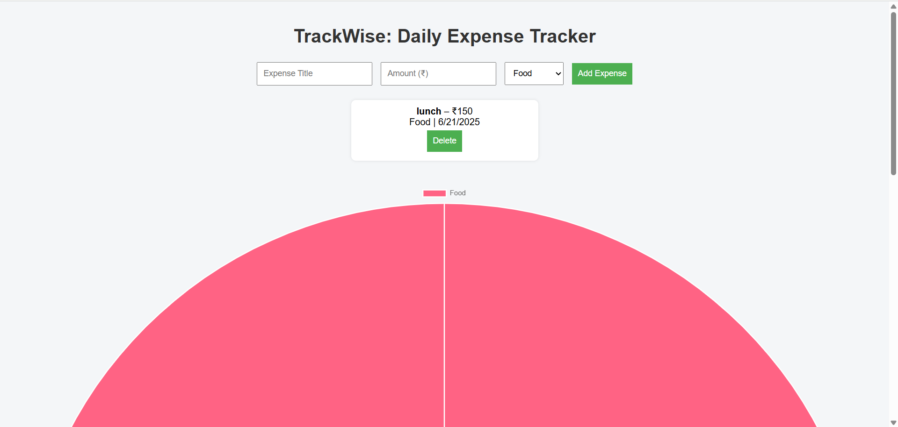

# TrackWise – Daily Expense Tracker 📊

TrackWise is a clean and simple web app to track your daily expenses and visualize where your money goes using a pie chart. Data is stored using your browser's localStorage, so it stays even after refresh or closing the browser.

## 🚀 Live Demo
👉 [Click here to view](https://manish2006756.github.io/trackwise/)

## ✨ Features

- 📝 Add and delete expenses
- 💾 Data saved using localStorage
- 📊 Live pie chart of spending by category (Chart.js)
- 📱 Responsive design (mobile + desktop)
- 🧠 Built with clean JavaScript logic

## 🛠️ Tech Stack

- HTML
- CSS
- JavaScript
- Chart.js
- GitHub Pages (for hosting)

## 📷 Screenshot

## 📁 How to Use

1. Open the app
2. Enter expense title, amount, and category
3. Click “Add Expense”
4. See it listed and reflected in the chart
5. Click “Delete” to remove an item

## 📄 License
Free to use and modify for educational purposes
